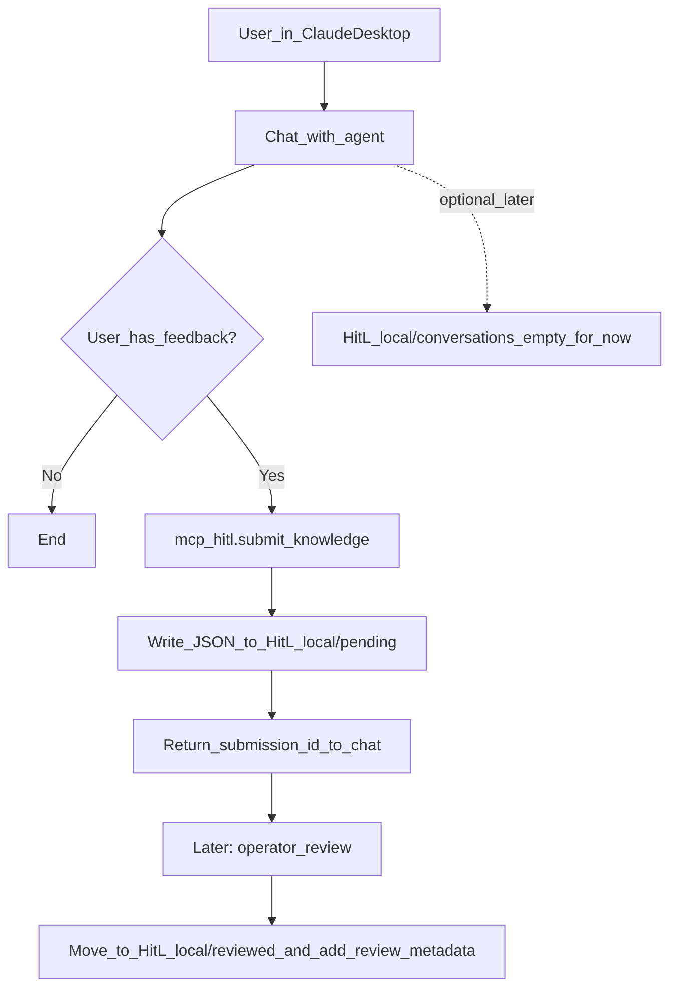

# HITL Feedback Capture (MVP)

## Overview
MCP server that lets Claude Desktop users submit **structured feedback** (corrections/additions/questions) for later review.

Notes:
- Claude Desktop does **not** expose full chat transcripts to MCP tools automatically; for now we store **feedback only**.
- `HitL_local/conversations/` exists as a future extension point and is empty in MVP.

## Repo layout (new)
```
mcp/hitl/
├── server.py            # MCP server implementation
└── agent_prompt.md      # Prompt/instructions that go to the agent
```

## Local storage layout
```
HitL_local/e
├── pending/                # New submissions awaiting review (MVP writes here)
├── reviewed/               # Reviewed submissions (empty for now)
└── conversations/          # Conversation context/logs (empty for now)
```

## IDs + timestamps (MVP decisions)
- **ID**: no `index.json`. Use a collision-resistant ID (recommended: `uuid4` or timestamp+random suffix).
  - File naming: `HitL_local/pending/<id>.json`
- **Time**: store `submitted_at_ms` as **epoch millis UTC** (integer). This aligns with the existing Neo4j model’s `updated_at: INTEGER`.

## Pipeline (simple)


## Submission schema (MVP)
```json
{
  "id": "HITL-<uuid_or_timestamp>",
  "type": "correction|addition|context|question",
  "submitted_at_ms": 1737465030000,
  "status": "pending",
  "content": {
    "vmrs_code": "047-000-000",
    "description": "What the user wants to record",
    "context": "Why this is valuable",
    "related_query": "Query that prompted this",

    "target_type": "Component|VendorPart",
    "target_key": {"code": "047-000-000"},
    "proposed_action": "set_property|add_relationship|remove_relationship",
    "proposed_payload": {"name": "New official name"}
  }
}
```

## Review metadata (file-first MVP)
When a submission is reviewed, move it from `pending/` to `reviewed/` and add:
```json
{
  "reviewed_at_ms": 1737469000000,
  "decision": "approved|rejected",
  "review_notes": "Why this was approved/rejected",
  "reviewed_by": "operator_name_or_id"
}
```

## MCP tools (MVP)
| Tool | Description |
|------|-------------|
| `submit_knowledge` | Create a new pending submission file and return the new ID |
| `get_submission_status` | Check status by ID |
| `list_submissions` | List recent pending submissions (no per-user identity in MVP) |

## Files to create
- `mcp/hitl/server.py`
- `mcp/hitl/agent_prompt.md`
- `HitL_local/pending/`
- `HitL_local/reviewed/`
- `HitL_local/conversations/`

## Implementation (MVP)
1. Create `HitL_local/{pending,reviewed,conversations}/`
2. Build MCP server in `mcp/hitl/server.py` (Python MCP SDK / `FastMCP`)
3. Add a local-only Claude Desktop MCP entry pointing to `mcp/hitl/server.py` (e.g. in `.claude/mcp.json`, which is gitignored)
4. Put the agent-facing guidance in `mcp/hitl/agent_prompt.md`

## Verification (MVP)
1. Run `python3 mcp/hitl/server.py`
2. Call `submit_knowledge` with test data
3. Verify JSON created in `HitL_local/pending/` and `submitted_at_ms` is present
4. Call `get_submission_status` with the returned ID
