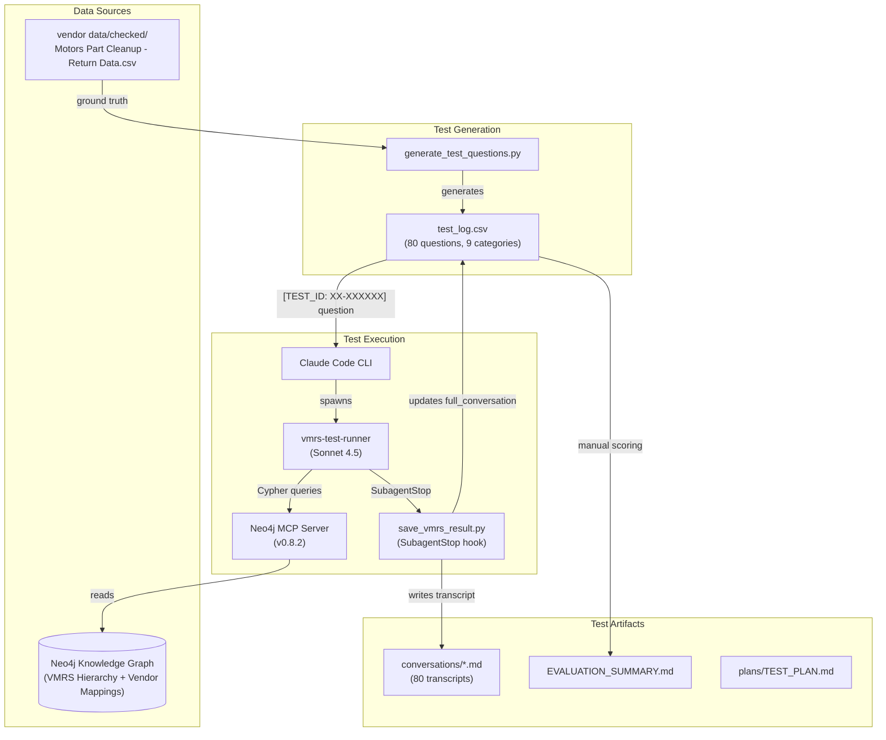
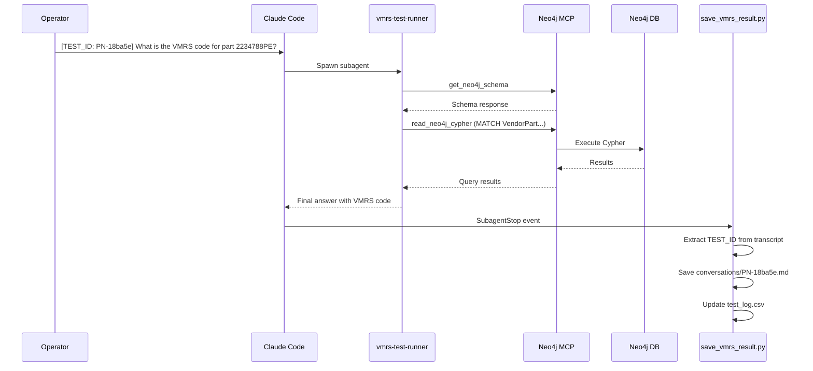
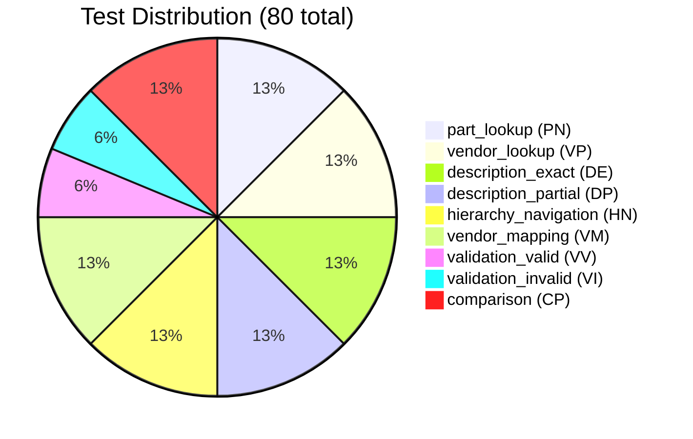
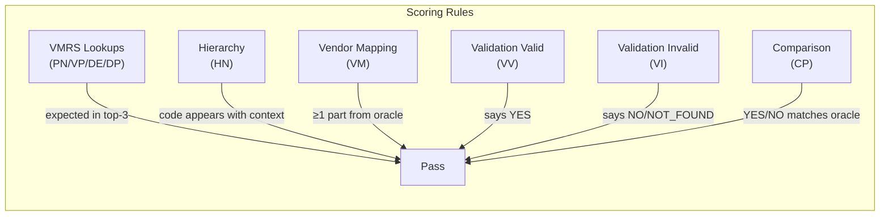

# VMRS Testing Architecture

## Overview Diagram

## Test Execution Flow

## Test Categories

## Component Details

### Data Layer

| Component | Path | Purpose |
|-----------|------|---------|
| Vendor CSV | `vendor data/checked/Motors Part Cleanup - Return Data.csv` | Ground truth for expected answers |
| Neo4j Graph | Remote (via MCP) | VMRS hierarchy + vendor part mappings |

### Test Generation

| Component | Path | Purpose |
|-----------|------|---------|
| Generator | `generate_test_questions.py` | Creates 80 test questions with oracles |
| Test Log | `test_log.csv` | Test cases, expected answers, results |

**Test ID Format**: `{PREFIX}-{SHA256(row_key)[:6]}`

| Category | Prefix | Count | Behavior |
|----------|--------|-------|----------|
| part_lookup | PN | 10 | KNOWN_PRESENT |
| vendor_lookup | VP | 10 | KNOWN_PRESENT |
| description_exact | DE | 10 | KNOWN_PRESENT |
| description_partial | DP | 10 | KNOWN_PRESENT |
| hierarchy_navigation | HN | 10 | KNOWN_PRESENT |
| vendor_mapping | VM | 10 | KNOWN_PRESENT |
| validation_valid | VV | 5 | KNOWN_PRESENT |
| validation_invalid | VI | 5 | KNOWN_ABSENT |
| comparison | CP | 10 | KNOWN_PRESENT |

### Test Execution

| Component | Path | Purpose |
|-----------|------|---------|
| Subagent | `.claude/agents/vmrs-test-runner.md` | Query Neo4j, answer VMRS questions |
| Hook | `.claude/hooks/save_vmrs_result.py` | Capture transcript on SubagentStop |
| MCP Server | Neo4j MCP v0.8.2 | Bridge to Neo4j database |

**Subagent Tools**:
- `mcp__neo4j-aura__get_neo4j_schema`
- `mcp__neo4j-aura__read_neo4j_cypher`

### Test Artifacts

| Artifact | Path | Purpose |
|----------|------|---------|
| Test Log | `test_log.csv` | Cases + results (source of truth) |
| Transcripts | `conversations/*.md` | Full tool calls + responses |
| Summary | `EVALUATION_SUMMARY.md` | Pass/fail by category |
| Plan | `plans/TEST_PLAN.md` | Methodology documentation |

## Pass/Fail Criteria

## Current Results

| Category | Pass | Total | Rate |
|----------|------|-------|------|
| part_lookup | 10 | 10 | 100% |
| vendor_lookup | 9 | 10 | 90% |
| description_exact | 10 | 10 | 100% |
| description_partial | 9 | 10 | 90% |
| hierarchy_navigation | 10 | 10 | 100% |
| vendor_mapping | 10 | 10 | 100% |
| validation_valid | 5 | 5 | 100% |
| validation_invalid | 0 | 5 | 0%* |
| comparison | 10 | 10 | 100% |
| **Total** | **73** | **80** | **91.25%** |

*validation_invalid failures are test-design issues (oracle mismatch), not interface defects.
